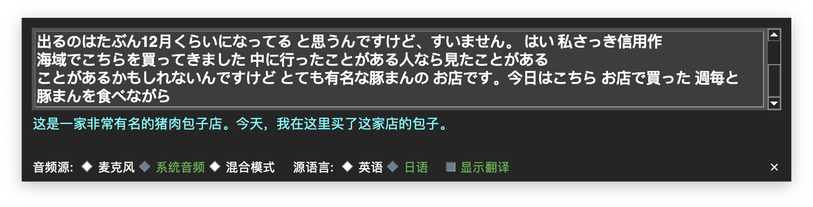

# My Live Caption - 实时字幕与翻译工具

这是一个基于 Python 的桌面应用，可以实时捕捉麦克风、系统音频或两者的混合，使用 OpenAI 的 Whisper 模型进行语音转文字，并利用 DeepL API 将文字翻译成中文。它以一个可拖动的、始终置顶的悬浮窗形式存在，方便您在进行会议、观看视频或玩游戏时获得实时字幕。



---

## ✨ 功能特性

- **多音频源切换**：可在“麦克风”、“系统音频”、“混合模式”之间自由切换。
- **实时流式字幕**：以平滑滚动的方式显示识别出的文字，并保留最近的上下文。
- **实时翻译**：可选择将识别出的字幕实时翻译成中文，并支持多句话的上下文关联。
- **悬浮窗设计**：界面是一个半透明的、无边框的悬浮窗，始终保持在屏幕最顶层，且可以随意拖动。
- **高度可配置**：通过 `config.ini` 文件调整高级参数，如设备ID、模型大小、灵敏度等。

---

## 🛠️ 安装与配置

### 1. 系统依赖

- **对于 macOS 用户**:
  使用 [Homebrew](https://brew.sh/index_zh-cn) 来安装 `portaudio` 和 `ffmpeg`。
  ```bash
  brew install portaudio ffmpeg
  ```
- **对于 Windows/Linux 用户**:
  请根据您系统的包管理器安装 `PortAudio` 和 `ffmpeg`。

### 2. 项目配置

1.  **克隆或下载项目**。

2.  **创建 `config.ini`**:
    项目中包含一个 `config.ini.template` 文件。请**复制**一份并将其重命名为 `config.ini`。

3.  **查找并配置设备ID**:
    - 在终端中，**首次运行脚本**：`python3 gui_caption.py`。
    - 如果 `config.ini` 中的设备ID为空，程序会自动打印出所有可用的音频设备及其ID。
    - **复制**您需要的“麦克风”和“系统音频”（例如 BlackHole）的设备ID。
    - **粘贴**到 `config.ini` 文件中对应的位置，例如：
      ```ini
      mic_device_id = 2
      system_audio_device_id = 4
      ```

4.  **配置API Key**:
    打开 `config.ini` 文件，**填入您自己的 DeepL API Key**。

5.  **创建并激活 Python 虚拟环境** (推荐):
    ```bash
    # 建议使用 Python 3.10 或更高版本
    python3 -m venv venv
    source venv/bin/activate
    ```

6.  **安装 Python 依赖**:
    ```bash
    pip install -r requirements.txt
    ```

---

## 🚀 运行应用

完成所有配置后，确保您的虚拟环境已激活，然后运行：

```bash
python3 gui_caption.py
```

在悬浮窗的控制栏，您可以随时切换想要的音频源模式。
