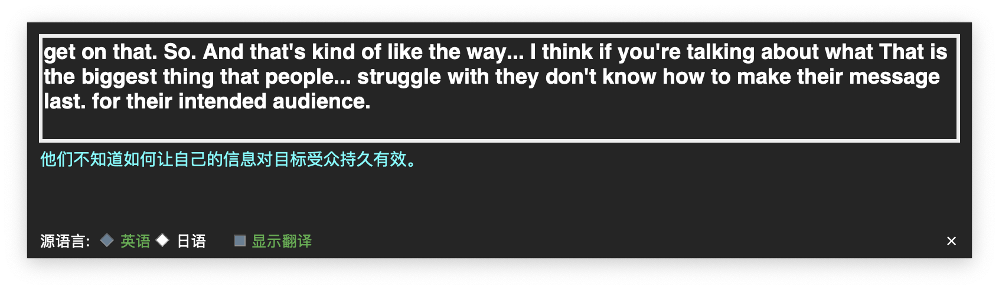

# My Live Caption - 实时字幕与翻译工具

这是一个基于 Python 的桌面应用，可以实时捕捉麦克风音频，使用 OpenAI 的 Whisper 模型进行语音转文字，并利用 DeepL API 将文字翻译成中文。它以一个可拖动的、始终置顶的悬浮窗形式存在，方便您在进行会议、观看视频或玩游戏时获得实时字幕。



---

## ✨ 功能特性

- **实时流式字幕**：以打字机动画效果平滑显示识别出的文字，并以滚动方式保留最近的上下文。
- **实时翻译**：可选择将识别出的字幕实时翻译成中文。
- **悬浮窗设计**：界面是一个半透明的、无边框的悬浮窗，始终保持在屏幕最顶层，且可以随意拖动。
- **高度可配置**：
    - 在界面上随时切换源语言（英语/日语）。
    - 在界面上随时开启或关闭翻译显示。
    - 通过 `config.ini` 文件调整更多高级参数，如模型大小、灵敏度等。

---

## 🛠️ 安装与配置

### 1. 系统依赖

首先，您需要安装一些必要的系统工具。

- **对于 macOS 用户**:
  使用 [Homebrew](https://brew.sh/index_zh-cn) 来安装 `portaudio` 和 `ffmpeg`。
  ```bash
  brew install portaudio ffmpeg
  ```
- **对于 Windows/Linux 用户**:
  请根据您系统的包管理器安装 `PortAudio` 和 `ffmpeg`。

### 2. 项目配置

1.  **克隆或下载项目**:
    将项目文件下载到您的电脑上。

2.  **创建并配置 `config.ini`**:
    项目中包含一个 `config.ini.template` 文件。请**复制**一份并将其重命名为 `config.ini`。
    然后，打开 `config.ini` 文件，**填入您自己的 DeepL API Key**。
    ```ini
    [DEEPL]
    api_key = YOUR_DEEPL_API_KEY_HERE
    ```
    您也可以根据需要调整此文件中的其他参数。

3.  **创建 Python 虚拟环境** (推荐):
    在项目根目录下打开终端，运行：
    ```bash
    # 建议使用 Python 3.10 或更高版本
    python3 -m venv venv
    
    # 激活虚拟环境
    # macOS / Linux:
    source venv/bin/activate
    # Windows:
    # venv\Scripts\activate
    ```

4.  **安装 Python 依赖**:
    在激活的虚拟环境中，运行以下命令来安装所有必需的库：
    ```bash
    pip install -r requirements.txt
    ```

---

## 🚀 运行应用

完成所有配置后，确保您的虚拟环境已激活，然后运行：

```bash
python3 gui_caption.py
```

应用启动后，屏幕上会出现一个半透明的黑色悬浮窗。您可以开始讲话，字幕和翻译便会实时显示。按住鼠标左键可以拖动窗口，点击右下角的 `✕` 按钮即可退出程序。

---

## ⚙️ 高级配置 (`config.ini`)

您可以通过编辑 `config.ini` 文件来微调应用的行为：

- `silence_threshold`: 静音检测的阈值。值越小，麦克风越灵敏。如果您的正常讲话有时无法被识别，可以适当调小此值（例如 `0.003`）。如果太多背景噪音被识别，可以调大此值。
- `model_type`: Whisper 模型的大小。`small` 是一个很好的平衡点。如果追求更高精度且电脑性能允许，可以尝试 `medium` 或 `large`。
- `subtitle_word_buffer_size`: 字幕区滚动的单词数量。可以适当增大或减小来调整上下文的长度。